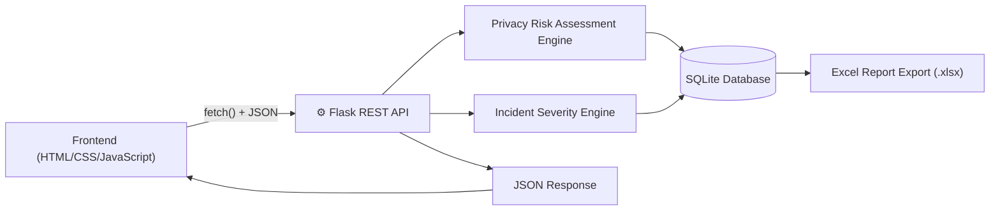
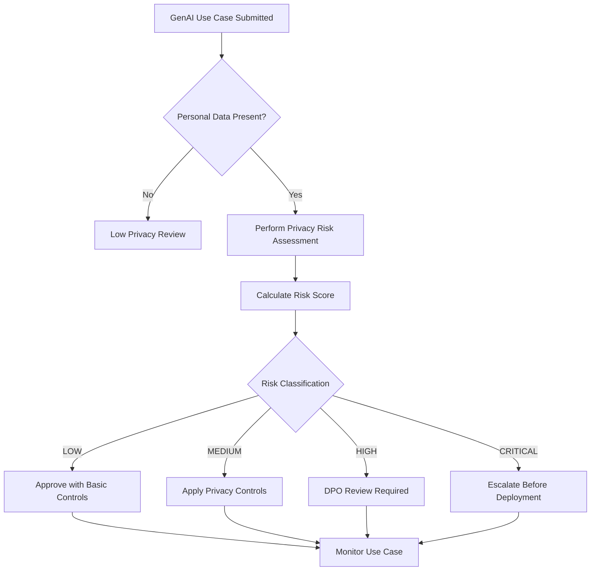
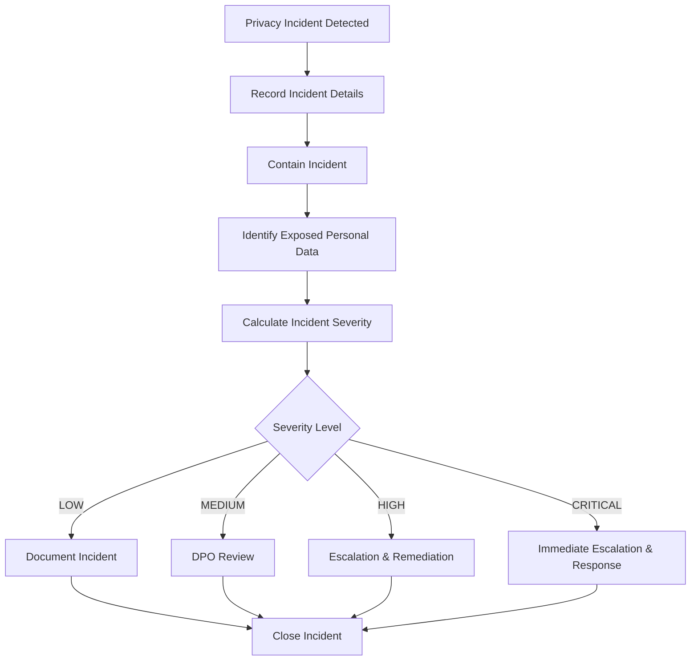
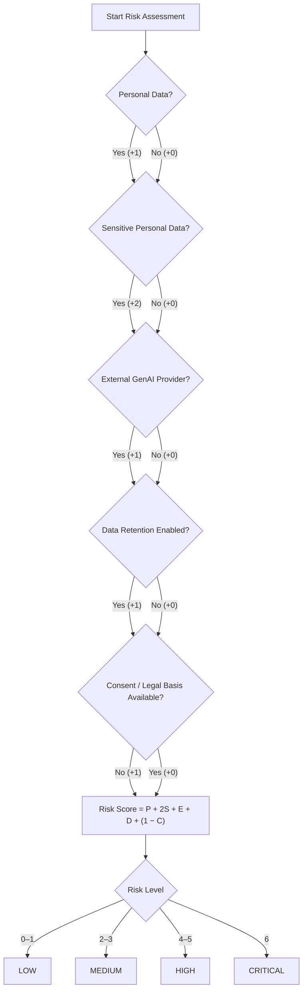

# System Architecture

---

# DPO Privacy Workflow

---

# Incident Management Workflow

---

# Privacy Risk Assessment Model

## Risk Assessment Mathematical Model

The GenAI DPO Privacy Framework uses a **deterministic weighted scoring model** to evaluate privacy risks associated with Generative AI use cases. Each privacy factor contributes a predefined weight to the overall risk score, making the assessment transparent and explainable.

### Privacy Risk Formula

\[
R = P + 2S + E + D + (1 - C)
\]

Where:

| Symbol | Description | Value |
|--------|-------------|-------|
| **P** | Personal Data is processed | 0 or 1 |
| **S** | Sensitive Personal Data is processed | 0 or 1 |
| **E** | External Generative AI provider is used | 0 or 1 |
| **D** | Data Retention is enabled | 0 or 1 |
| **C** | Consent or Legal Basis is available | 0 or 1 |

### Weight Justification

- **Personal Data (+1):** Processing personal information introduces privacy obligations.
- **Sensitive Personal Data (+2):** Sensitive information has a higher privacy impact and therefore receives a higher weight.
- **External AI Provider (+1):** Third-party AI services increase data-sharing and governance risk.
- **Data Retention (+1):** Retaining prompts or outputs increases long-term exposure.
- **No Consent (+1):** Lack of consent or legal basis increases compliance risk.

### Risk Classification

| Risk Score | Classification |
|------------|----------------|
| **0 – 1** | LOW |
| **2 – 3** | MEDIUM |
| **4 – 5** | HIGH |
| **6** | CRITICAL |

### Example Calculation

**Use Case:** Customer Support Ticket Summarization

| Privacy Factor | Value |
|----------------|-------|
| Personal Data | YES (+1) |
| Sensitive Data | YES (+2) |
| External AI Provider | YES (+1) |
| Data Retention | YES (+1) |
| Consent Available | NO (+1) |

**Risk Score**

\[
R = 1 + 2 + 1 + 1 + 1 = 6
\]

**Result:** **CRITICAL RISK**

The application generates mitigation recommendations such as data minimization, privacy review, DPO approval, and deployment escalation for high-risk use cases.

## Incident Severity Mathematical Model

The Incident Management module evaluates the severity of GenAI privacy incidents using a weighted scoring model based on the impact of the incident.

### Incident Severity Formula

\[
I = 2S + E + U + F
\]

Where:

| Symbol | Description | Score |
|--------|-------------|-------|
| **S** | Sensitive Personal Data exposed | +2 |
| **E** | External AI provider involved | +1 |
| **U** | Number of affected users | +1 (≥100), +2 (≥500) |
| **F** | Financial or account-related information exposed | +1 |

### Severity Classification

| Incident Score | Severity |
|---------------|----------|
| **0 – 1** | LOW |
| **2 – 3** | MEDIUM |
| **4 – 5** | HIGH |
| **6 or above** | CRITICAL |

### Example Calculation

**Incident:** Unauthorized GenAI Upload

| Incident Factor | Value |
|-----------------|-------|
| Sensitive Data | YES (+2) |
| External AI Used | YES (+1) |
| Affected Users | 250 (+1) |
| Account IDs Exposed | YES (+1) |

**Incident Score**

\[
I = 2 + 1 + 1 + 1 = 5
\]

**Result:** **HIGH SEVERITY**

The application recommends containment, DPO review, remediation, documentation, and escalation for high-severity incidents.
