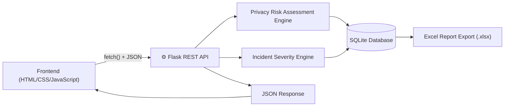
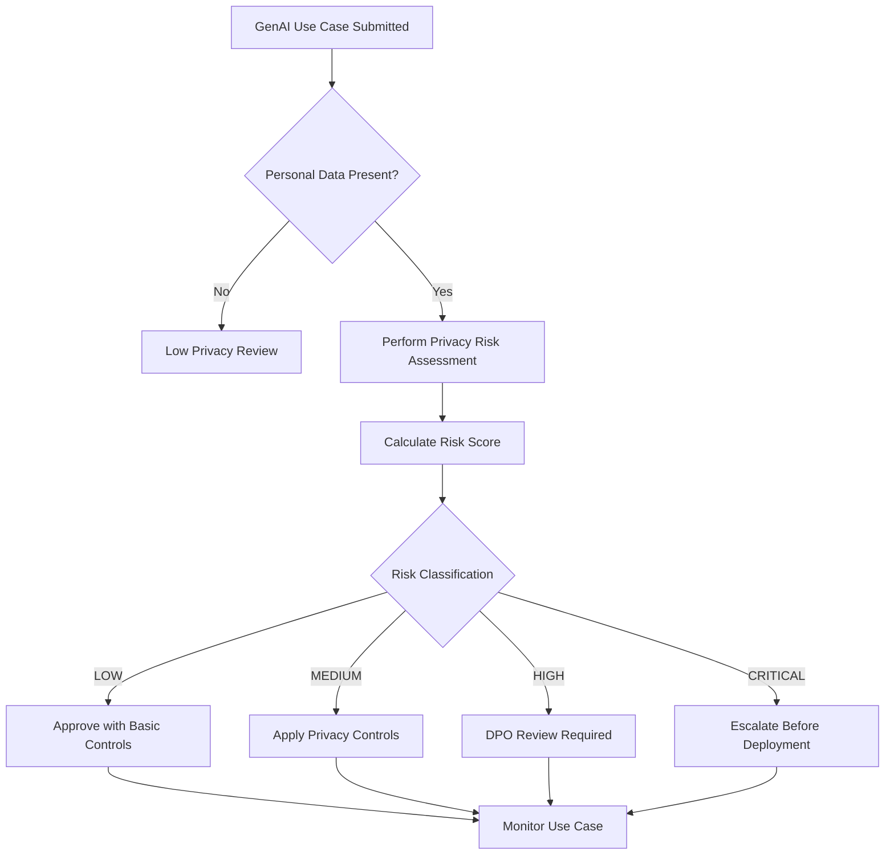
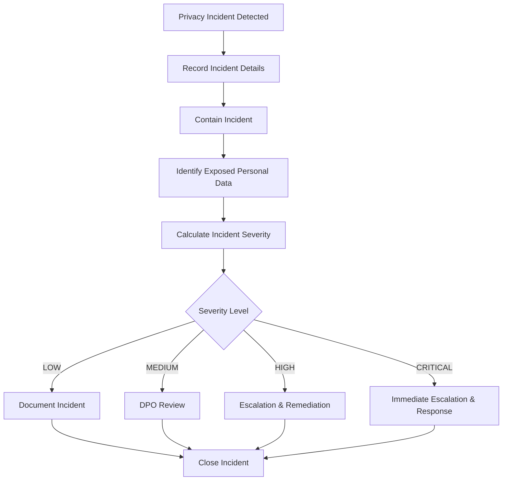
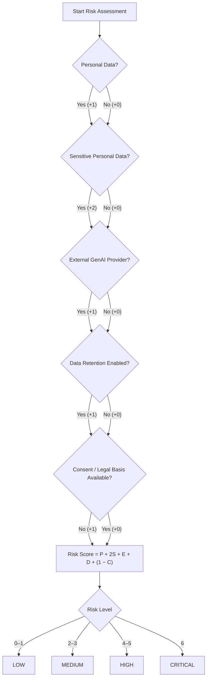

# System Architecture

```mermaid
flowchart LR
    A["Frontend (HTML/CSS/JavaScript)"] -->|"fetch() + JSON"| B["⚙️ Flask REST API"]

    B --> C["Privacy Risk Assessment Engine"]
    B --> D["Incident Severity Engine"]

    C --> E[(SQLite Database)]
    D --> E

    E --> F["Excel Report Export (.xlsx)"]

    B --> G["JSON Response"]
    G --> A
```

---

# DPO Privacy Workflow

```mermaid
flowchart TD
    A["GenAI Use Case Submitted"] --> B{"Personal Data Present?"}

    B -- "No" --> C["Low Privacy Review"]

    B -- "Yes" --> D["Perform Privacy Risk Assessment"]

    D --> E["Calculate Risk Score"]

    E --> F{"Risk Classification"}

    F -- "LOW" --> G["Approve with Basic Controls"]

    F -- "MEDIUM" --> H["Apply Privacy Controls"]

    F -- "HIGH" --> I["DPO Review Required"]

    F -- "CRITICAL" --> J["Escalate Before Deployment"]

    G --> K["Monitor Use Case"]
    H --> K
    I --> K
    J --> K
```

---

# Incident Management Workflow

```mermaid
flowchart TD
    A["Privacy Incident Detected"] --> B["Record Incident Details"]

    B --> C["Contain Incident"]

    C --> D["Identify Exposed Personal Data"]

    D --> E["Calculate Incident Severity"]

    E --> F{"Severity Level"}

    F -- "LOW" --> G["Document Incident"]

    F -- "MEDIUM" --> H["DPO Review"]

    F -- "HIGH" --> I["Escalation & Remediation"]

    F -- "CRITICAL" --> J["Immediate Escalation & Response"]

    G --> K["Close Incident"]
    H --> K
    I --> K
    J --> K
```

---

# Privacy Risk Assessment Model

```mermaid
flowchart TD
    A["Start Risk Assessment"] --> B{"Personal Data?"}

    B -- "Yes (+1)" --> C
    B -- "No (+0)" --> C

    C{"Sensitive Personal Data?"}
    C -- "Yes (+2)" --> D
    C -- "No (+0)" --> D

    D{"External GenAI Provider?"}
    D -- "Yes (+1)" --> E
    D -- "No (+0)" --> E

    E{"Data Retention Enabled?"}
    E -- "Yes (+1)" --> F
    E -- "No (+0)" --> F

    F{"Consent / Legal Basis Available?"}
    F -- "No (+1)" --> G
    F -- "Yes (+0)" --> G

    G["Risk Score = P + 2S + E + D + (1 − C)"] --> H{"Risk Level"}

    H -- "0–1" --> I["LOW"]
    H -- "2–3" --> J["MEDIUM"]
    H -- "4–5" --> K["HIGH"]
    H -- "6" --> L["CRITICAL"]
```
